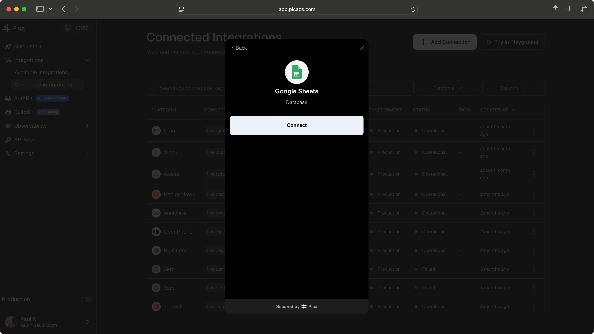

# AuthKit Next.js Demo App

[AuthKit](https://www.npmjs.com/package/@picahq/authkit) is a drop-in component for third-party authentication that works with all major frontend frameworks. Instead of building OAuth flows and managing credentials for dozens of platforms, you can embed AuthKit and let your users securely connect their Gmail, Slack, Salesforce, QuickBooks, and other accounts in minutes—think Plaid, but for integrations.

## Check it out: [Pica AuthKit Demo](https://github.com/picahq/authkit-demo)