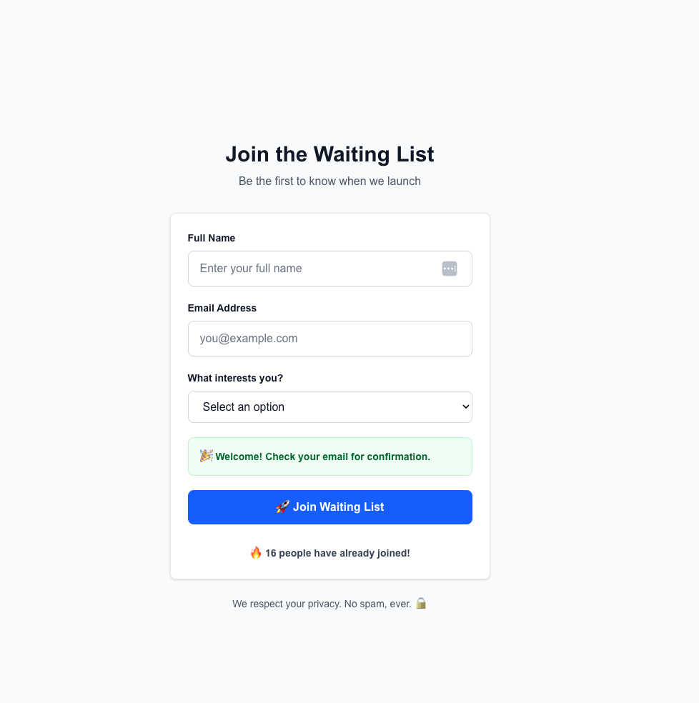

# Waitlist Signup App with InstantDB

A real-time waiting list app built with **Next.js**, **InstantDB**, and **Pica's Gmail integration**.  
Collect signups, send welcome emails, and manage them with a live dashboard.



---

## 🛠 Prerequisites
 
- [InstantDB account](https://instantdb.com)  
- [Pica account](https://picaos.com)  

---

## ⚡️ Setup

### 1. Clone Repo
```bash
git clone https://github.com/your-username/waiting-list-app.git
cd waiting-list-app
```

### 2. Install Dependencies

```bash
npm install
```

### 3. Environment Variables

Create a `.env.local` file in the project root:

```bash
NEXT_PUBLIC_INSTANT_APP_ID=your_instant_app_id

PICA_SECRET_KEY=your_pica_secret_key
PICA_GMAIL_CONNECTION_KEY=your_gmail_connection_key
```

---

## Environment Setup

### InstantDB

1. Go to [InstantDB](https://instantdb.com) and create a new app.
2. In your app dashboard, copy the **App ID**.
3. Paste it into `.env.local` as:

   ```bash
   NEXT_PUBLIC_INSTANT_APP_ID=your_instant_app_id
   ```

### Pica

1. Go to [Pica](https://picaos.com) and sign in.
2. Create a **Gmail connection** under Connections → Gmail.
3. Copy your **Connection Key** and **Secret Key** from the dashboard.
4. Paste them into `.env.local` as:

   ```bash
   PICA_SECRET_KEY=your_pica_secret_key
   PICA_GMAIL_CONNECTION_KEY=your_gmail_connection_key
   ```

---

## Run Locally 🚀

```bash
npm run dev
```

* Signup page → [http://localhost:3000](http://localhost:3000)
* Admin dashboard → [http://localhost:3000/admin](http://localhost:3000/admin)


## 💬 Support

Need help?
- 📧 [Pica Documentation](https://docs.picaos.com)
- 📚 [InstantDB Docs](https://instantdb.com/docs) 
- 💬 [InstantDB community Support](https://discord.gg/instantdb)

**Happy building!** 🚀